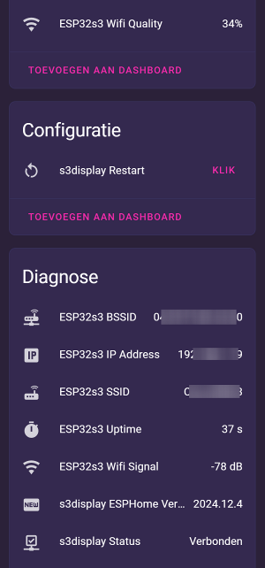

# Simplify your esphome config with _packages_

### Use this github package to simplify your Esphome configuration files that imports common functions (ESP32-devices)

```yaml
substitutions:
  device_name: test_device_lab
  friendly_name: LAB Test Device 13

packages:
  common_files:
    url: https://github.com/2technology/esphome_config
    ref: main
    refresh: 1d
    files: [common/fonts.yaml,
            common/common.yaml
    ]

esphome:
  name: $device_name
  friendly_name: $friendly_name
  # the rest of your config file
```

# What does `common.yaml` include

The `common.yaml` file in the `2technology/esphome_config` repository defines several sensors, text sensors, binary sensors, and buttons for ESPHome configurations:

- **Sensors:**
  - WiFi signal strength (`wifi_s`)
  - WiFi quality (`wifi_quality`)
  - Device uptime (`uptime_s`)

- **Text Sensors:**
  - ESPHome version
  - WiFi info (IP address, SSID, BSSID)

- **Binary Sensors:**
  - Device status

- **Buttons:**
  - Restart device

- **OTA:**
  - ESPHome OTA with password protection


# Exposed Home Assistant Entities
